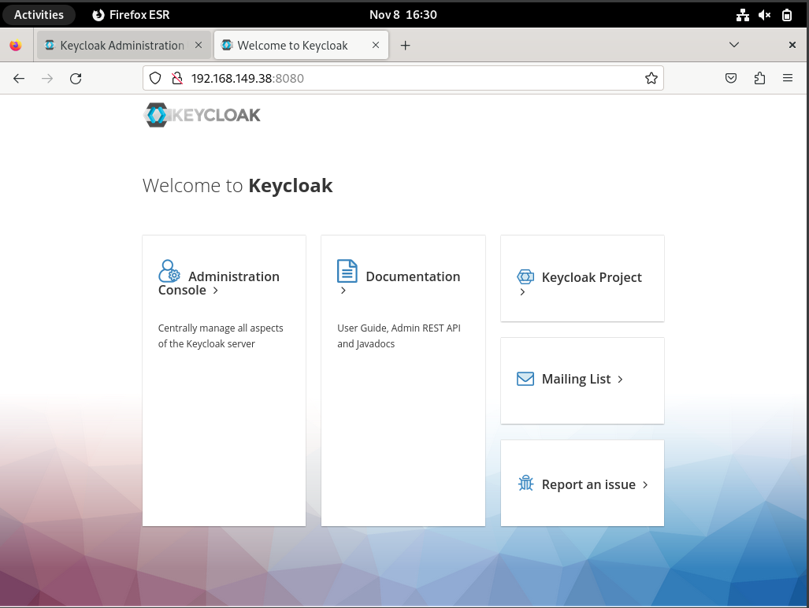
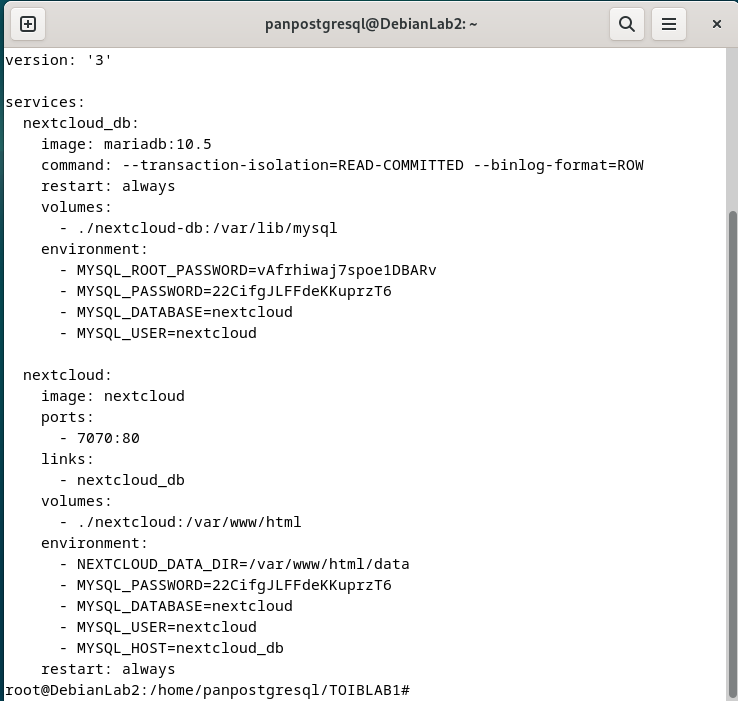
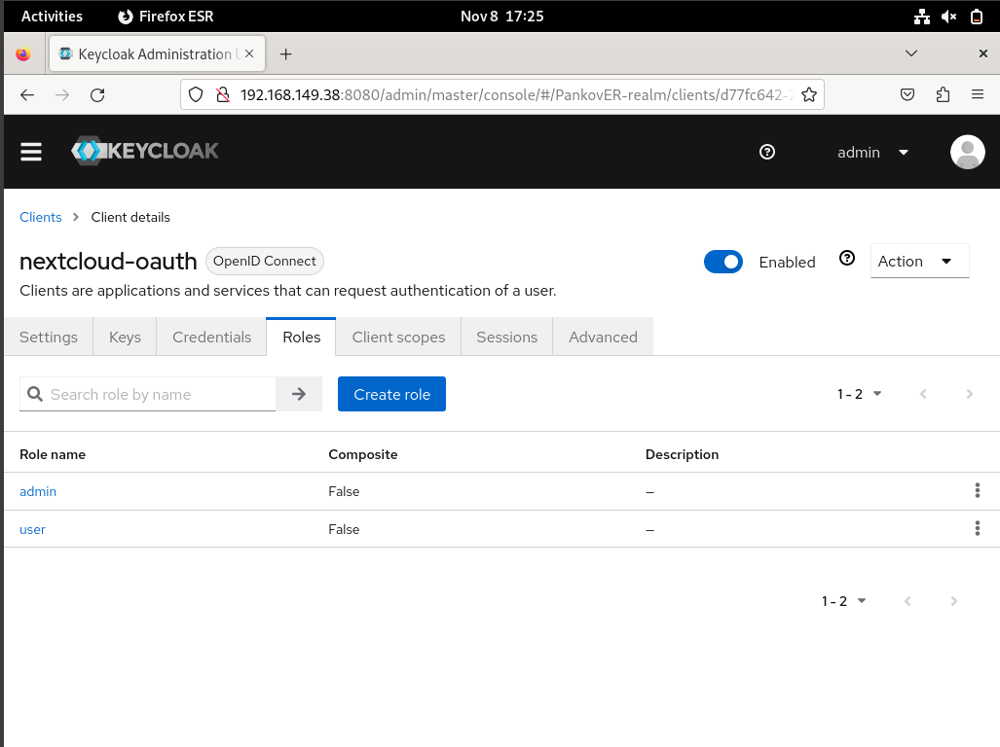

# TOIB-LAB1-Pankov_ER

## Развёртывание Keycloak при помощи Docker-compose

## Стартовая страница Keycloak

## Панель входа в Keycloak

## Создание realm

## Создание пользователей

## Проверка наличия созданных пользователей

## Развёртывание Nextcloud при помощи Docker

## Создание клиента

## Создание ролей

## Cтартовая страница Nextcloud

## Установка Social Login

## Конфигурация для работы с Keycloak

## Проверка возможность идентификации через Keycloak

## Включение двухфакторной аутентификации

## Страница настройки 2FA

## Страница ввода одноразового кода

